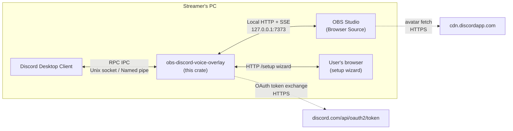
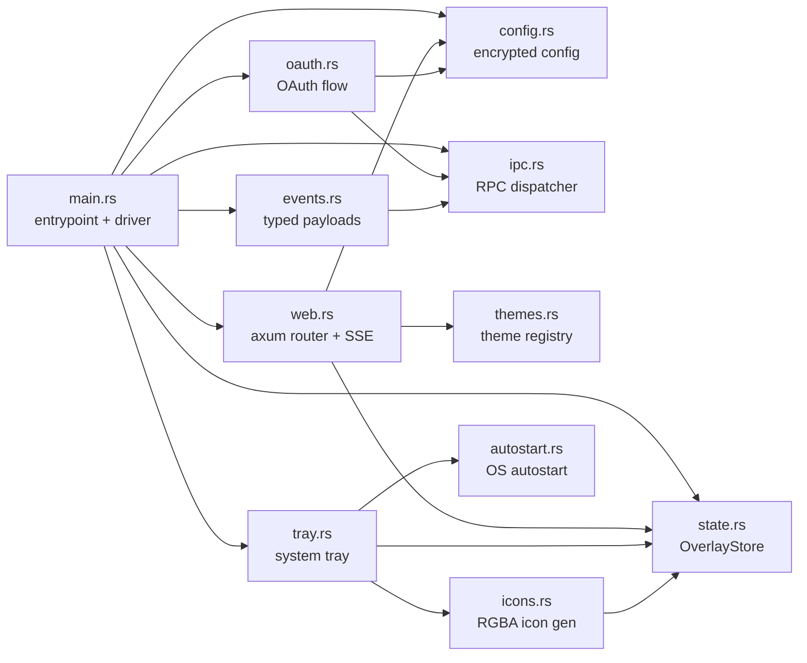
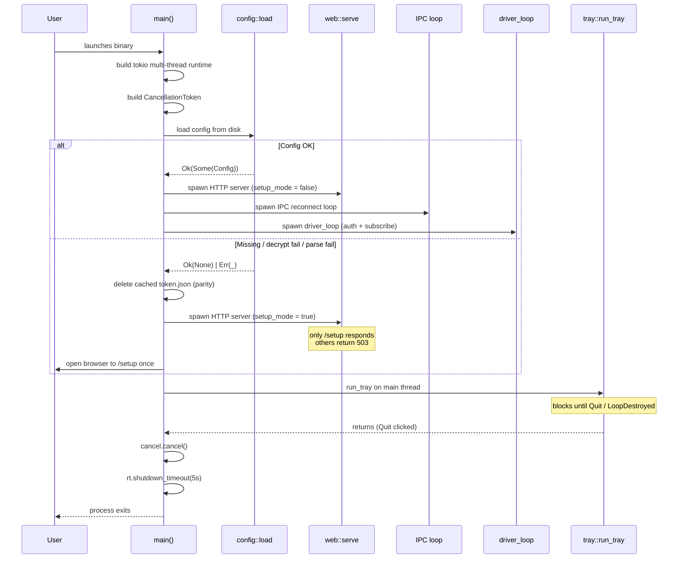
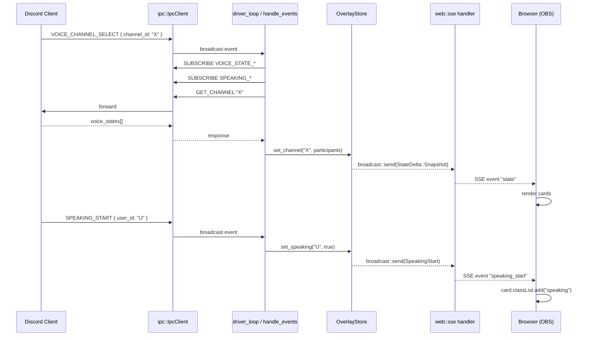
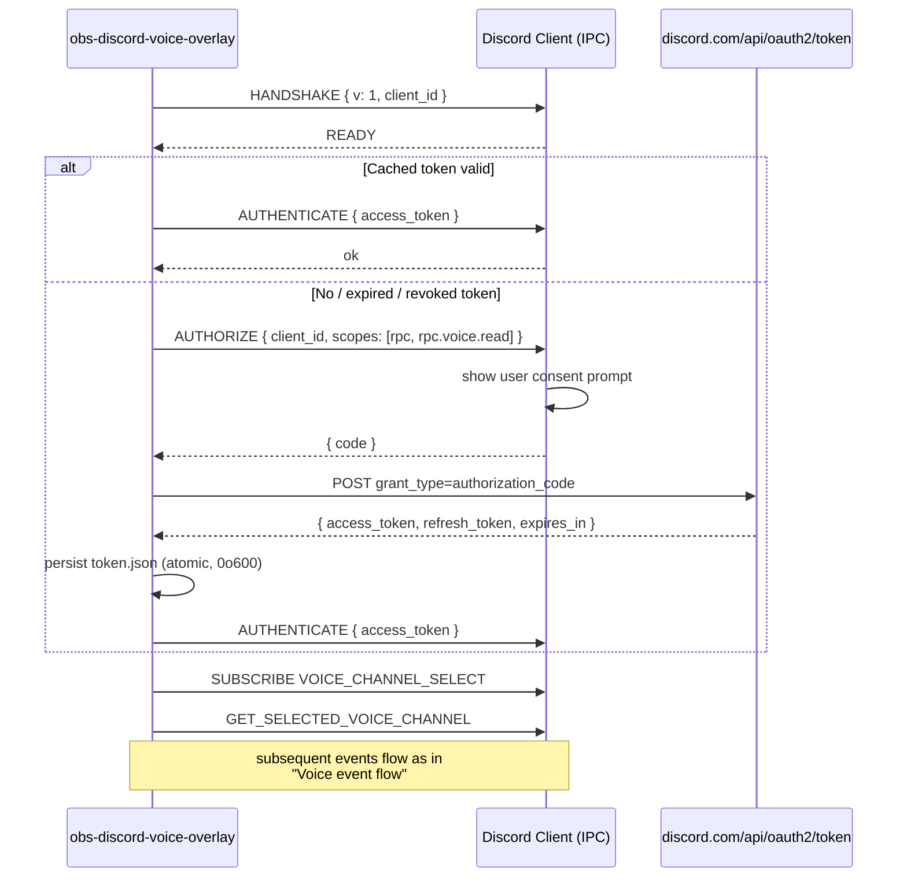
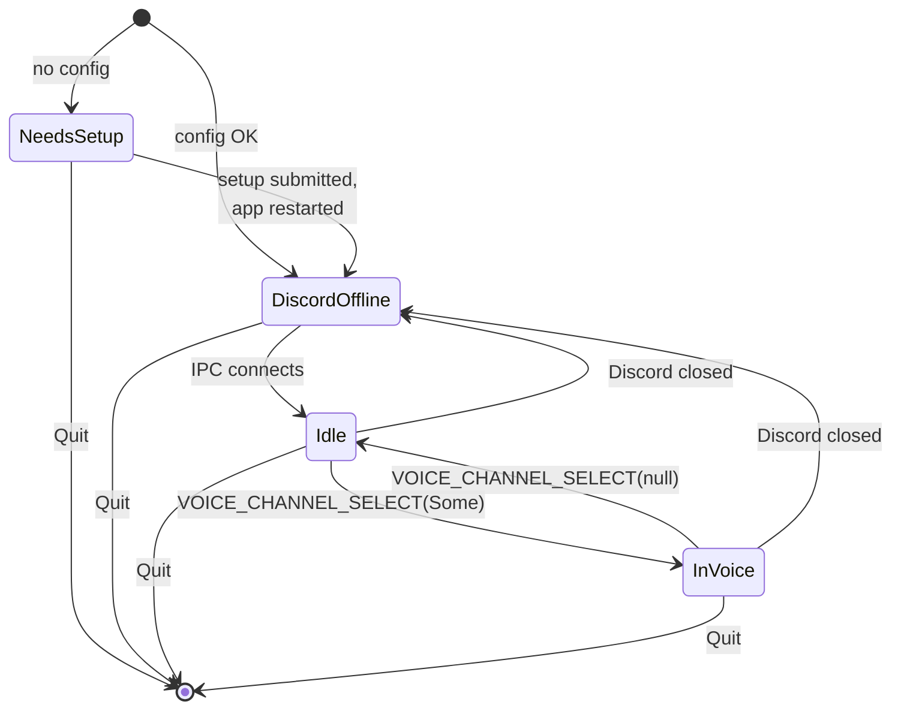
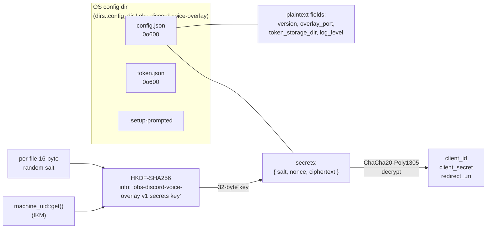
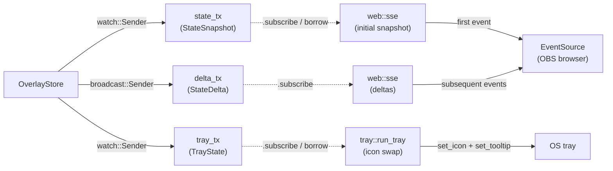
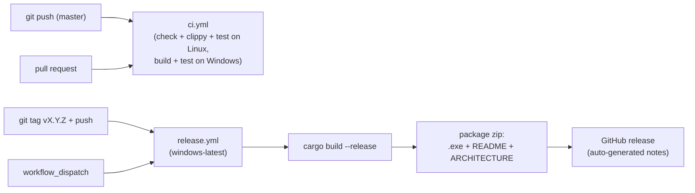

# Architecture

`obs-discord-voice-overlay` is a single Rust binary that bridges a local Discord client (via RPC IPC) to an OBS Browser Source (via local HTTP + SSE), rendering a customizable overlay of the user's current voice channel with live speaking effects.

## Component overview



Discord IPC is local-only (Unix socket on Linux/macOS, named pipe on Windows), so the binary must run on the same machine as Discord. There is no remote-deployment mode.

## Process model

The binary runs as one OS process with two threads:

```mermaid
flowchart TB
    subgraph MainThread["Main thread (UI event loop)"]
        Tray["tray-icon + tao<br/>event loop"]
        Menu["Right-click menu:<br/>Preview / Configure / Autostart / Quit"]
    end

    subgraph TokioRuntime["Tokio multi-thread runtime"]
        HTTP["axum HTTP server<br/>(SSE + setup wizard)"]
        IPC["IPC reconnect loop<br/>(ipc::spawn_ipc_loop)"]
        Driver["driver_loop<br/>(IPC status watcher)"]
        Events["handle_events<br/>(per-connection)"]
    end

    MainThread -->|spawn at startup| TokioRuntime
    MainThread <-->|tao::EventLoopProxy<br/>+ watch::Receiver| TokioRuntime
    MainThread -->|Quit → cancel.cancel()| TokioRuntime
```

**Why this layout.** `tray-icon` requires a Win32 message loop on the thread that created the icon, so the main thread is the natural fit. Tokio runs in a worker via `Builder::new_multi_thread().enable_all().build()`. Communication: tray menu actions reach async land through `tokio::sync::mpsc`; tray state updates reach the UI thread through a `tokio::sync::watch::Receiver<TrayState>` polled inside the event loop.

**Shutdown.** Quit triggers `cancel.cancel()` on a `tokio_util::sync::CancellationToken` shared by HTTP, IPC driver, and event handler. They drain gracefully; main calls `rt.shutdown_timeout(Duration::from_secs(5))` after the event loop returns via `tao`'s `run_return` (so the timeout is actually reachable — `EventLoop::run` is `!`-returning and would otherwise bypass it).

## Module map



| Module | Role |
|---|---|
| `main.rs` | Sync `fn main()`. Builds the tokio multi-thread runtime, spawns `async fn run`, runs `tray::run_tray` on the main thread. Wires the cancellation token. |
| `config.rs` | Persistent JSON config. Sensitive fields (`client_id`, `client_secret`, `redirect_uri`) AEAD-encrypted (ChaCha20-Poly1305) under a key derived via HKDF-SHA256 from `machine-uid`. Atomic write at mode `0o600`. |
| `ipc.rs` | Cross-platform Discord RPC client. 8-byte LE header + JSON body, frame size capped at 16 MiB. Async command dispatcher (oneshot replies, broadcast events). Reconnect loop with exponential backoff. |
| `oauth.rs` | OAuth flow over RPC: `AUTHORIZE` → token exchange (`POST /oauth2/token`) → `AUTHENTICATE` → refresh. Token persisted at `{config_dir}/.../token.json` with mode `0o600` on Unix. |
| `events.rs` | Typed Discord RPC payloads (`VoiceState`, `Speaking`, `ChannelSelect`) + `SUBSCRIBE` helpers. |
| `state.rs` | `OverlayStore`: in-memory state with `tokio::sync::watch` for snapshots and `broadcast` for deltas. `TrayState` derived from `connected` + `channel_id` + `needs_setup`. |
| `themes.rs` | Compile-time theme registry (`include_str!`) for 3 themes: `default`, `minimal`, `neon`. URL-name → assets resolver with `default` fallback. |
| `web.rs` | axum router: SSE at `/events`, theme assets at `/themes/<name>/...`, setup wizard at `/setup`. `setup_mode_guard` middleware returns 503 for non-`/setup` routes when config is missing. |
| `tray.rs` | System tray icon (cross-platform via `tray-icon` + `tao`). 4 visual states. Right-click menu. Linux is best-effort (degrades gracefully when no tray daemon). |
| `icons.rs` | Programmatic 16×16 antialiased RGBA icon rendering per `TrayState`. No asset files. |
| `autostart.rs` | Cross-platform autostart toggle via `auto-launch` crate. Returns `Result<bool>` so transient OS errors don't masquerade as "off". |

## Startup sequence



## Voice event flow



## OAuth + IPC handshake



Mid-session 401 recovery is wrapped via `auth_command` in `main.rs`: on token-invalid errors the access token is refreshed via `refresh_token`, AUTHENTICATE re-issued, and the original command retried once.

## Tray state machine



Each state maps to a distinct icon color:

| State | Color | Hex |
|---|---|---|
| `NeedsSetup` | amber | `#faa61a` |
| `DiscordOffline` | grey | `#71808a` |
| `Idle` | Discord blurple | `#5865f2` |
| `InVoice` | Discord green | `#57f287` |

## Configuration storage



`config.json` schema:

```json
{
  "version": 1,
  "overlay_port": 7373,
  "token_storage_dir": null,
  "log_level": "info",
  "secrets": {
    "v": 1,
    "salt": "<base64, 16 bytes>",
    "nonce": "<base64, 12 bytes>",
    "ciphertext": "<base64, AEAD output>"
  }
}
```

**Threat model:**
- ✅ **Portability lock** — a config file copied to another machine fails to decrypt because the machine UID differs.
- ✅ **Tamper detection** — AEAD authenticates the ciphertext; modification invalidates the tag.
- ❌ **NOT confidential against local attackers** — the machine UID is world-readable on Linux (`/etc/machine-id`, mode `0644`) and readable by any local process on Windows (`HKLM\SOFTWARE\Microsoft\Cryptography\MachineGuid`). For true confidentiality, an OS keystore (DPAPI / Keychain / Secret Service) is needed — deferred.

## State management



Two-channel pattern:

- **`watch`** for the **current snapshot** — subscribers always see the latest, never miss the "current state" on reconnect, naturally coalesces rapid updates.
- **`broadcast`** for **incremental deltas** (`ParticipantJoin`, `SpeakingStart`, `VoiceStateUpdate`, etc.) — subscribers see every event in order with a small buffer.

The SSE handler subscribes to deltas first, then takes a snapshot, then chains `[snapshot, deltas...]` so no event is dropped between snapshot capture and subscription. On `RecvError::Lagged`, a fresh `state` snapshot is pushed to force resync rather than silently dropping.

## HTTP surface

| Path | Method | Purpose | Setup mode |
|---|---|---|---|
| `/` | GET | Serve current theme's `overlay.html` | 503 |
| `/themes/<name>/style.css` | GET | Theme CSS (404 on unknown name) | 503 |
| `/themes/<name>/app.js` | GET | Theme JS (404 on unknown name) | 503 |
| `/events` | GET | SSE stream of overlay state | 503 |
| `/setup` | GET | Configuration wizard form | 200 |
| `/setup` | POST | Save configuration | 200 / 400 / 403 |

URL options (parsed client-side by each theme):

| Option | Values | Effect |
|---|---|---|
| `theme` | `default` / `minimal` / `neon` | Server-side asset routing (default fallback for `/`) |
| `speaking_only` | `0` / `1` | When `1`, hide non-speaking cards |
| `hide` | comma-separated user IDs | Skip rendering listed users (typical: hide self) |
| `size` | 24-256 | Avatar size override (`default` and `neon` only) |

Setup wizard guards:

- `setup_mode_guard` middleware returns 503 for non-`/setup` paths when setup mode is active.
- `RequestBodyLimitLayer::new(64 * 1024)` globally.
- `check_origin` on POST `/setup` — `Host` must match `localhost:{port}` or `127.0.0.1:{port}`, `Origin` (if present) must match the same. Lightweight CSRF defense for the localhost-only HTTP surface.
- Form fields validated: non-empty `client_id` and `client_secret`, `redirect_uri` parseable and `http://`/`https://` only, `port` in `[1024, 65535]`, no control characters (`\r`, `\n`, `\0`) in any field.

## Cross-platform considerations

| Concern | Linux | Windows | macOS |
|---|---|---|---|
| IPC transport | Unix socket at `$XDG_RUNTIME_DIR/discord-ipc-{0..9}` (incl. snap/flatpak prefixes) | Named pipe `\\.\pipe\discord-ipc-{0..9}` | Unix socket |
| Tray UI | Best-effort (StatusNotifierItem); gated off in current builds for dev VMs | Full support via `tao` event loop | Full support |
| Autostart | `~/.config/autostart/*.desktop` | `HKEY_CURRENT_USER\Software\Microsoft\Windows\CurrentVersion\Run` | Login Items |
| Machine UID source | `/etc/machine-id` | `HKLM\SOFTWARE\Microsoft\Cryptography\MachineGuid` | `IOPlatformUUID` |
| Config dir | `~/.config/obs-discord-voice-overlay/` | `%APPDATA%\obs-discord-voice-overlay\` | `~/Library/Application Support/obs-discord-voice-overlay/` |
| File mode `0o600` | yes (`OpenOptionsExt`) | n/a (NTFS ACL inherits from `%APPDATA%`) | yes |
| Console hidden in release | n/a | `windows_subsystem = "windows"` (release only) | n/a |

The Linux dev-VM scenario: tray UI is gated to Windows + macOS. On Linux, the binary still runs — IPC + HTTP + SSE work unchanged — but no icon is placed in the tray; `cancel.cancelled()` is awaited on the existing tokio runtime handle and Ctrl-C exits gracefully.

## Build & deploy

- One Rust crate, one binary. Public release target is Windows; macOS and Linux compile and run.
- 3 themes embedded via `include_str!` — no asset shipping or runtime asset loading.
- Tray icons rendered programmatically (no PNG/ICO assets).
- `_probes/rpc-scope-probe/` is a separate workspace member used as a smoke test for Discord OAuth scope validation; not part of the runtime.
- No external network dependencies at runtime besides Discord (`discord.com/api/oauth2/token` for the token exchange and `cdn.discordapp.com` for browser-loaded avatars).

### CI / release pipeline



Workflow files live in `.github/workflows/`:
- `ci.yml` — runs on push to `master`/`main` and on pull requests; gates merges on a clean Linux build + clippy + tests, and a clean Windows build + tests.
- `release.yml` — runs on `v*.*.*` tag push or manual `workflow_dispatch`; produces a zipped Windows binary and publishes it as a GitHub release.

The repository currently lives on GitLab; the GitHub workflows assume the source is mirrored to or migrated to a GitHub repository. A GitLab CI equivalent can be derived if needed.

## References

| Document | Status |
|---|---|
| [`spec-discord-voice-overlay.md`](../_bmad-output/implementation-artifacts/spec-discord-voice-overlay.md) | done — core RPC + SSE + themes |
| [`spec-desktop-tray-app.md`](../_bmad-output/implementation-artifacts/spec-desktop-tray-app.md) | done — tray + autostart + console-hidden |
| [`spec-persistent-config.md`](../_bmad-output/implementation-artifacts/spec-persistent-config.md) | done — encrypted config + setup wizard |
| [`deferred-work.md`](../_bmad-output/implementation-artifacts/deferred-work.md) | running backlog of post-review defers |
